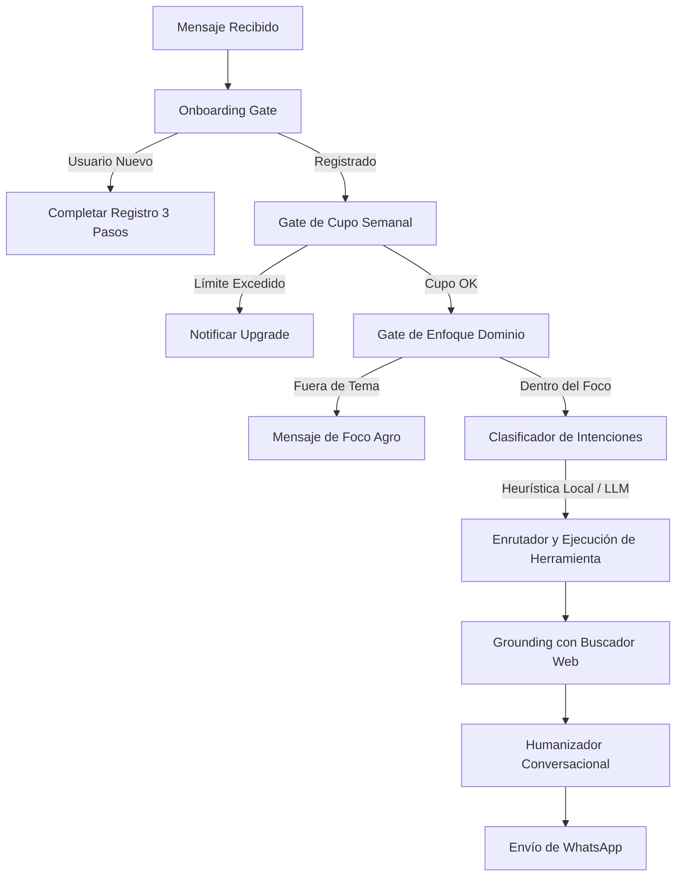

# 🌾 AgroHabilis — Manual de Alcance y Arquitectura Técnica (Master Blueprint)

Este documento sirve como la **referencia canónica** del proyecto **AgroHabilis** para contextualizar a modelos de Inteligencia Artificial (como Gemini), desarrolladores o arquitectos de software sobre las capacidades, el funcionamiento y el diseño del agente conversacional.

---

## 🚀 1. ¿Qué es AgroHabilis?

**AgroHabilis** es un asistente inteligente y consultor agropecuario premium diseñado para productores de Argentina. Opera de forma 100% conversacional a través de **WhatsApp**, permitiendo a los productores gestionar sus establecimientos, registrar hacienda, cultivos y finanzas, y consultar datos de mercado (precios de granos, hacienda, clima y finanzas) en tiempo real mediante lenguaje natural, audio o imágenes.

### Filosofía de Diseño:
* **"Tool-First" y Conversación Cálida:** El bot no se limita a conversar; analiza de forma estructurada lo que el usuario quiere hacer, ejecuta la base de datos o consulta APIs externas, y luego humaniza la respuesta con un tono empático, rural y profesional.
* **Resiliencia Local:** Cuenta con analizadores heurísticos locales sumamente avanzados que garantizan el funcionamiento y la persistencia de datos (ej. registro de stock) incluso si los proveedores de IA tienen latencia o caídas.

---

## 🛠️ 2. Módulos Funcionales (Qué puede hacer el Agente)

El agente está organizado en módulos altamente integrados que interactúan a través de comandos o diálogos naturales:

### A. Módulo de Precios y Mercado
* **Gramos (BCR):** Precios al día de la Pizarra de Rosario (Soja, Maíz, Trigo, Girasol, Cebada, Sorgo).
* **Hacienda (Cañuelas):** Valores del novillo, vaquillonas, terneros y vacas del Mercado Agroganadero de Cañuelas (MAG).
* **Monedas y Finanzas:** Cotización del Dólar MEP, Dólar Oficial y Dólar Blue en tiempo real.
* **Búsqueda Grounding:** Si el dato no está en la base de datos local, el agente utiliza **IA Grounding (Google Search)** para extraer noticias, cotizaciones históricas o reportes climáticos de fuentes oficiales con fecha y fuente explícita.

### B. Módulo de Clima y Geolocalización
* **Pronóstico Georreferenciado:** Integrado con OpenWeather y bases meteorológicas locales.
* **Multi-Zonas:** Los productores pueden registrar tantas zonas/ciudades como deseen (sin límites por plan). El bot analiza automáticamente las coordenadas geográficas de los partidos para entregar pronósticos de lluvias milimétricos y alertas climáticas específicas.

### C. Módulo de Inventario y Trazabilidad (Lotes e Hacienda)
* **Carga de Cultivos:** Registro de siembras por lote ("Sembré 120 ha de maíz en Lote Norte"), guardando variedades, fecha de siembra y expectativas de rinde.
* **Carga de Hacienda (Ganadería):** Clasificación por categorías (Vacas, Novillos, Vaquillonas, Terneros, Toros) y tipos de producción (Vacuno cría, vacuno tambo, etc.).
* **Carga Multilote (Pro):** Permite procesar planillas o textos extensos con múltiples lotes de una sola vez ("Lote 1: 30 vacas; Lote 2: 45 novillos").
* **Trazabilidad Individual:** Soporte para registrar animales individuales mediante caravanas, estados sanitarios (vacunado, enfermo) y observaciones clínicas.

### D. Módulo de Finanzas Agrícolas (Doble Entrada Simplificada)
* **Gastos:** Registro en lenguaje natural de insumos, labores o compras ("Gasté 2 millones en Urea en el Lote 5", "Compré 10 bolsas de glifosato").
* **Ventas:** Registro de comercialización de granos o animales ("Vendí 120 tn de soja a 420 USD").
* **Margen Neto:** Generación de resúmenes de rentabilidad en caliente ("MI MARGEN") que contrastan ingresos vs. egresos por categoría e insumo.

### E. Módulo de Planificación y Trazabilidad Avanzada (Premium)
* **Rotación de Pasturas (Semáforo Dinámico):** Visualización interactiva en panel del estado de ocupación, días de descanso y remanente vegetativo por lote. Integrado en WhatsApp con semáforos de pastoreo en tiempo real al consultar lotes.
* **Calculadora Agrónoma de Raciones y Mixer:** Herramienta matemática que computa raciones diarias sobre Materia Seca (MS) y peso húmedo en kilogramos por insumo (maíz, silaje, concentrados) para dietas de Feedlot, Suplementación o Pastura. Disponible en la Web Cliente y vía WhatsApp con la herramienta `domain.calculate_ration`.
* **Planillas Clínicas y Trazabilidad PDF:** Exportador certificado de planillas oficiales listas para impresión física o firmas de manga veterinaria para auditorías. Disponible en Web y activado vía link interactivo en WhatsApp mediante `domain.export_animal_pdf`.

### F. Módulo de Alertas Inteligentes
* **Alertas de Precio:** Configuración de avisos automáticos ("Avisame cuando el maíz Rosario supere los $180.000"). Las alertas se evalúan diariamente en el corte del mercado y notifican de inmediato al WhatsApp del productor.

---

## ⚡ 3. Arquitectura del Flujo de Turnos (Turn Loop)

Cuando un productor envía un mensaje de WhatsApp (texto, audio o foto), se ejecuta un **Pipeline de Procesamiento de Turnos** secuencial y blindado contra fallas:

### Detalle de los Componentes Clave:
1. **Onboarding Gate (`src/services/onboarding.js`):** Valida que el usuario tenga Nombre, Actividad principal y al menos una Zona. Si falta algún dato, lo guía cálidamente paso a paso sin interrumpir el flujo.
2. **Gate de Cupo Semanal (`cupo_excedido.js`):** Mide el consumo de interacciones (incluyendo transcripción de audios e inspección de imágenes de silobolsas o planillas con Gemini Vision) contra el plan del usuario.
3. **Gate de Dominio (`dominio_turno.js`):** Filtra preguntas fuera del negocio agropecuario (ej. "Quién ganó el partido de ayer") para proteger los tokens del modelo y reorientar al productor hacia las capacidades del bot.
4. **Clasificador e Inteligencia Híbrida (`clasificador.js` y `nl_heuristica.js`):**
   * **LLM (Groq / Gemini):** Clasifica la intención del usuario y extrae parámetros en JSON.
   * **Heurísticas locales:** Si el LLM falla, el parser heurístico analiza unidades (tn, ha, kg, litros), productos (urea, glifosato) y cantidades para que el registro en base de datos nunca falle.
5. **Humanizador de Respuestas:** Recibe los datos crudos del sistema (ej. JSON de precios o clima) y los redacta con un tono campero, claro, utilizando emojis contextuales (🌾, 🐂, 🚜, 🌧️) y sin tecnicismos innecesarios.

---

## 💰 4. Modelo de Precios y Limitaciones

AgroHabilis adoptó un esquema moderno de **Planes Unificados (Unbundled Features)**. Esto significa que **todas las funcionalidades** (alertas, multi-zonas, inventario, finanzas, trazabilidad) están habilitadas para el 100% de los usuarios. La limitación comercial se define exclusivamente por el **cupo de interacciones semanales**:

| Plan | Costo Mensual | Cupo de Mensajes Semanales | Límite de Zonas | Funciones Incluidas |
| :--- | :--- | :--- | :--- | :--- |
| **GRATIS** | $0/mes | **15 mensajes** | Sin Límite (999) | Todas las herramientas del Agente |
| **BÁSICO** | $9.000/mes | **50 mensajes** | Sin Límite (999) | Todas las herramientas del Agente |
| **PRO** | $18.000/mes | **150 mensajes** | Sin Límite (999) | Todas las herramientas del Agente |
| **PRO MAX** | $50.000/mes | **Ilimitado** (Tope técnico) | Sin Límite (999) | Soporte prioritario y trazabilidad avanzada |

* **Consumo de Multimedia:** Los audios (transcritos automáticamente) y las fotos cargadas (procesadas por visión artificial) computan dentro del cupo semanal según la complejidad del procesamiento.

---

## 💻 5. Pila Tecnológica (Tech Stack)

* **Backend principal:** Node.js (ES6 / CommonJS).
* **Base de Datos:** PostgreSQL (Tablas clave: `usuarios`, `usuario_zonas`, `historial_consultas`, `alertas_precio`, `lotes_cultivos`, `hacienda_stock`, `finanzas_movimientos`).
* **Integración WhatsApp:** Baileys / `whatsapp-web.js` (acoplado a un webhook robusto con control de reintentos y encolamiento de mensajes).
* **Modelos de Lenguaje (LLMs):**
  * **Clasificación y Ruteo:** Llama-3.1 via Groq (primario por velocidad) / Gemini-1.5-Flash (secundario).
  * **Procesamiento de Archivos y Visión:** Gemini-1.5-Flash / Pro (para lectura de planillas de hacienda escritas a mano, fotos de ganado o remates).
  * **Asistente Conversacional local (Reaseguro):** Fallback robusto configurado mediante Ollama local en la VPS.
* **Servidor de Producción:** Servidor VPS Ubuntu autogestionado por PM2 (`agrohabilis`).

---

## 💡 Instrucciones para Gemini (Uso Conversacional)

Cuando actúes como la IA de AgroHabilis, recordá:
1. **Tu tono es único:** Sos un asistente cálido, respetuoso y con identidad de campo argentina. Usás términos como *"lote"*, *"hacienda"*, *"rinde"*, *"disponible"* o *"pizarra"*.
2. **Priorizá datos precisos:** Si no sabés un dato o no está en la base, buscalo en la web y aclará la fuente meteorológica o de mercado. No inventes cotizaciones.
3. **Mantenelo corto y al grano:** Los productores leen en el celular mientras trabajan en la cabina del tractor o en la manga con los animales. Respuestas concisas, bien formateadas con negritas y bullets.
