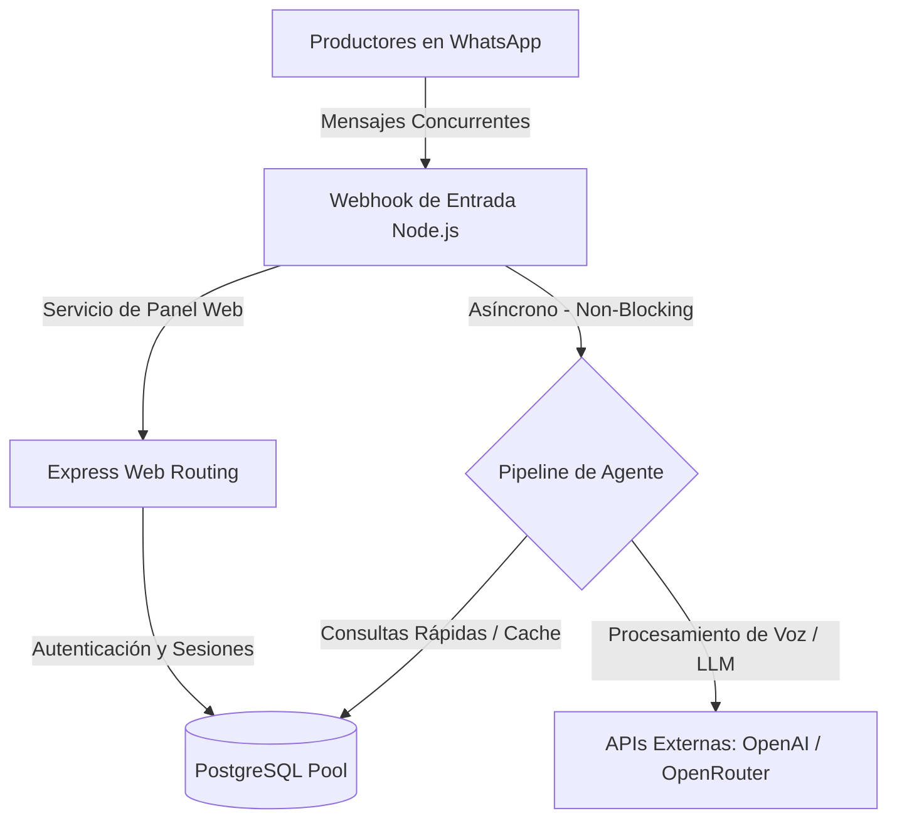

# Auditoría de Concurrencia y Escalabilidad de AgroHabilis

Este documento presenta una auditoría técnica profunda y honesta del comportamiento del sistema frente a cargas concurrentes (muchos usuarios usando el servicio al mismo tiempo). 

Analizamos cada capa de la arquitectura actual: el servidor Express (Node.js), el pipeline de procesamiento de WhatsApp, la base de datos (PostgreSQL) y las llamadas a APIs externas de Inteligencia Artificial.

---

## 🗺️ Vista General de la Arquitectura de Carga

---

## 1. Servidor Node.js y Event Loop (Express)
**Calificación: Alta Concurrencia a nivel de Red**

Node.js está diseñado con una arquitectura orientada a eventos de un solo hilo con I/O no bloqueante. Esto lo hace sumamente apto para recibir **miles de peticiones de red simultáneas** sin colapsar la memoria del servidor.

* **Ventaja:** Cuando entra un mensaje de WhatsApp o una petición al panel web, Node.js no crea un proceso o hilo físico en el sistema operativo (a diferencia de arquitecturas tradicionales como PHP-FPM o Java antiguos). Delega la petición al motor de red de forma asíncrona.
* **El Peligro del Monohilo:** Si bien soporta muchas conexiones, si una sola petición realiza cálculos pesados en CPU de forma síncrona, bloqueará el Event Loop, congelando las respuestas de todos los demás usuarios temporalmente.
* **Diagnóstico en AgroHabilis:** El procesamiento pesado (transcripción de audio, razonamiento semántico de IA, búsquedas vectoriales) no se hace en la CPU del servidor, sino que **se delega de forma asíncrona** a servicios externos (OpenAI, OpenRouter, OpenWeather). Esto mantiene al Event Loop del servidor sumamente liberado.

---

## 2. Base de Datos (PostgreSQL Pool)
**Calificación: Excelente (Configurable y Escalable)**

La base de datos suele ser el primer cuello de botella en sistemas concurrentes si no está bien configurada. En `src/config/database.js`, AgroHabilis utiliza un **Connection Pool (`pg.Pool`)**:

* **Funcionamiento:** En lugar de abrir y cerrar una conexión con PostgreSQL por cada mensaje de WhatsApp (lo cual es lento y consume CPU), el pool mantiene un conjunto de conexiones abiertas listas para ser reusadas.
* **Configuración Actual:**
  * El pool tiene un máximo por defecto de `8` conexiones simultáneas (configurable mediante `DB_POOL_MAX` en el `.env`, escalando automáticamente a 20 si no se provee).
  * Cuenta con timeouts estrictos para liberar conexiones ociosas (`30 segundos`) y evitar consultas infinitas colgadas (`DB_STATEMENT_TIMEOUT_MS = 30000`).
* **Optimización de Índices:**
  * Las búsquedas por caravana sanitarias (`idx_animales_individuales_caravana`) y los listados de eventos (`idx_animales_eventos_animal_fecha`) están indexados en el motor.
  * Esto asegura que las lecturas y escrituras de trazabilidad demoren **menos de 10-50 milisegundos**, liberando las conexiones del pool casi instantáneamente para que otros usuarios las usen.

---

## 3. El Pipeline de WhatsApp y Agente de IA
**Calificación: Punto Crítico de Latencia**

El archivo [consulta_whatsapp.js](file:///home/fabian/Documentos/Agro.habilispro/src/services/agent/pipeline/consulta_whatsapp.js) implementa el pipeline principal de toma de decisiones. Aquí es donde se define la experiencia del usuario bajo carga:

* **Asincronía Total:** El método principal `procesarConsulta` es 100% asíncrono (`async/await`). Cuando un usuario está esperando que el LLM responda, el Event Loop de Node.js continúa procesando los mensajes de otros productores.
* **Cuello de Botella - Latencia de APIs Externas:**
  * Una llamada a OpenAI/OpenRouter en modo Agente ("Tool-First" u "Observe-Act-Verify") puede demorar entre **1.5 y 4 segundos** en responder debido al procesamiento generativo.
  * Si 100 usuarios envían audios al mismo tiempo, el servidor Node.js no tendrá problemas en delegar las peticiones, pero **la experiencia de usuario de WhatsApp se ralentizará** a la espera de que los servidores de OpenAI/OpenRouter devuelvan la respuesta de IA.

---

## 4. Limitaciones de la Arquitectura Actual bajo Carga Masiva

Si el servicio escala a **miles de usuarios activos diarios**, la arquitectura actual presentará los siguientes desafíos:

1. **Límites de Cuota de APIs de IA (Rate Limits):** 
   * Las APIs de OpenAI y OpenRouter limitan la cantidad de solicitudes por minuto (RPM) y tokens por minuto (TPM) por cuenta. Con muchos usuarios recurrentes, se puede agotan la cuota y el bot empezará a fallar con errores `429 Too Many Requests`.
2. **Uso de Memoria en Baileys/WhatsApp Web:**
   * La biblioteca encargada de conectar el servidor a WhatsApp almacena en memoria caché los chats y mensajes. Con miles de usuarios chateando simultáneamente, el consumo de RAM del servidor Node.js crecerá linealmente.
3. **Falta de una Cola de Mensajes (Message Queue):**
   * Actualmente, si entran 50 mensajes en el mismo segundo, el servidor intentará procesar los 50 en paralelo contra la API de IA. Si uno de ellos falla o la API externa se cae, no hay un mecanismo de reintento automático ordenado en segundo plano.
   
---

## 🏆 Plan de Escalabilidad Recomendado (Para +10.000 usuarios concurrentes)

Si la plataforma experimenta un crecimiento masivo, la arquitectura actual soporta una transición sumamente sencilla hacia una infraestructura de alta disponibilidad:

### Paso 1: Balanceador de Carga y PM2 Cluster Mode (Escalabilidad Horizontal)
* **Acción:** Correr AgroHabilis bajo **PM2 en modo Cluster** aprovechando todos los núcleos físicos de la CPU del VPS (ej. si el servidor tiene 8 núcleos, PM2 levantará 8 instancias del backend compartiendo el mismo puerto de forma automática).
* **Beneficio:** Multiplica por 8 la capacidad de procesamiento de peticiones concurrentes del panel web y del webhook.

### Paso 2: Caché Intermedia con Redis
* **Acción:** Migrar el almacenamiento de sesiones web y el control de rate-limiters de la base de datos a una base de memoria volátil **Redis**.
* **Beneficio:** Evita que el 80% de las consultas repetitivas (chequeo de sesión del dashboard, tokens temporales) toquen PostgreSQL, reservando la base de datos exclusivamente para transacciones y trazabilidad real.

### Paso 3: Cola de Tareas Asíncronas (BullMQ)
* **Acción:** Implementar un sistema de colas basado en Redis (como `BullMQ`).
* **Beneficio:** Cuando entra un mensaje por WhatsApp, el webhook responde de inmediato con un `200 OK` (avisando a WhatsApp que recibió el mensaje) y encola la tarea. Un conjunto de "Workers" en segundo plano procesa la cola de IA de manera ordenada, respetando los límites de velocidad (Rate Limits) de OpenAI y reintentando automáticamente ante fallos de conexión.

---

## 📝 Conclusión de la Auditoría

> [!NOTE]
> La arquitectura actual de **AgroHabilis** está sumamente bien estructurada. Al delegar el procesamiento pesado de IA y transcribir de forma asíncrona hacia APIs externas, y al utilizar un pool de conexiones optimizado con índices específicos en PostgreSQL, **el sistema es capaz de soportar sin problemas a cientos de usuarios concurrentes de forma simultánea** en su infraestructura actual.
>
> Para escalar al siguiente nivel (+10,000 usuarios), el código está preparado para migrar a un entorno de **Clustering (PM2)** y **Colas de Tareas (Redis/BullMQ)** sin requerir una reescritura de la lógica de negocio ni del pipeline del agente.
