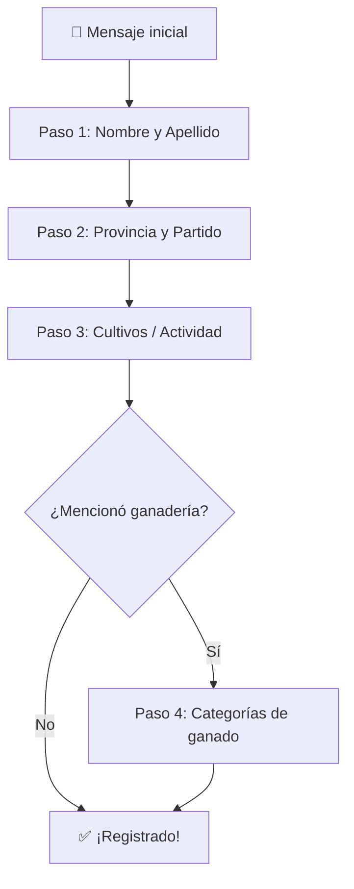
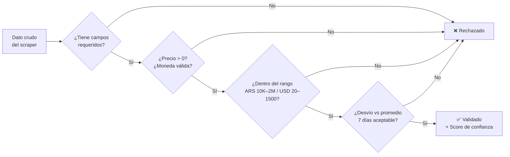
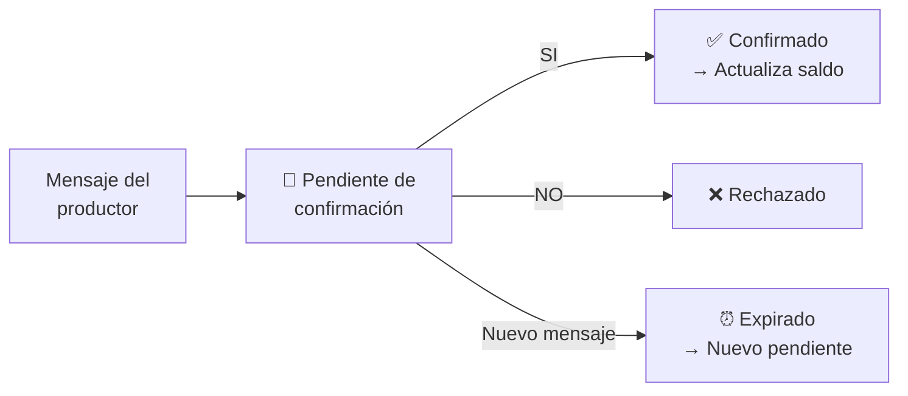
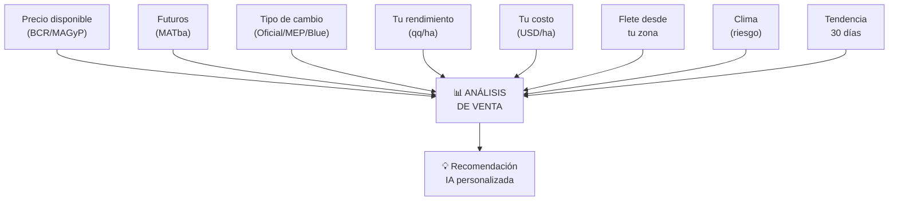
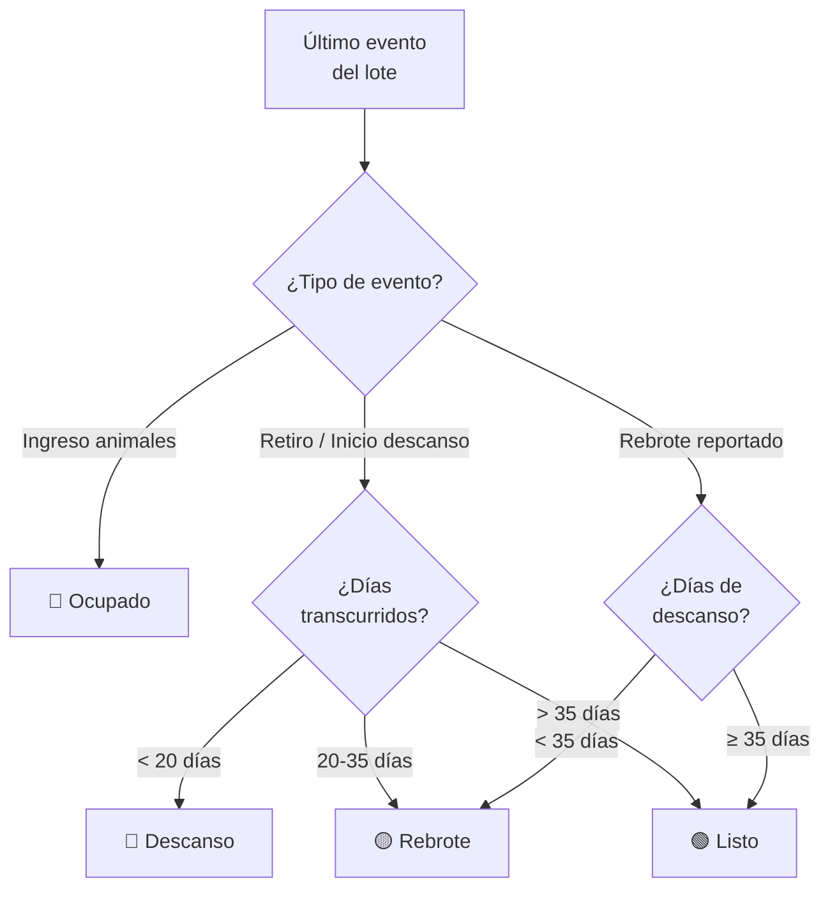
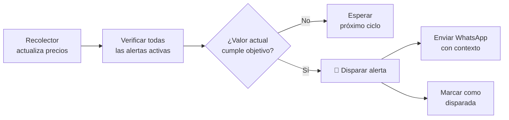
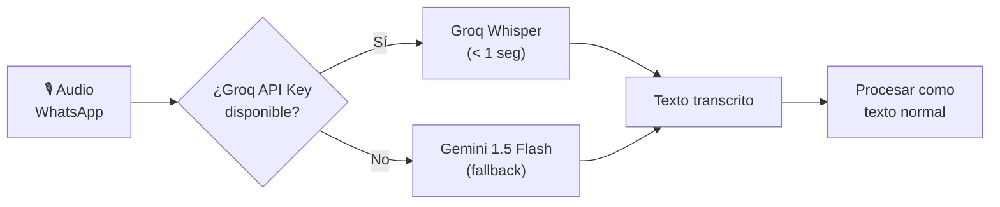
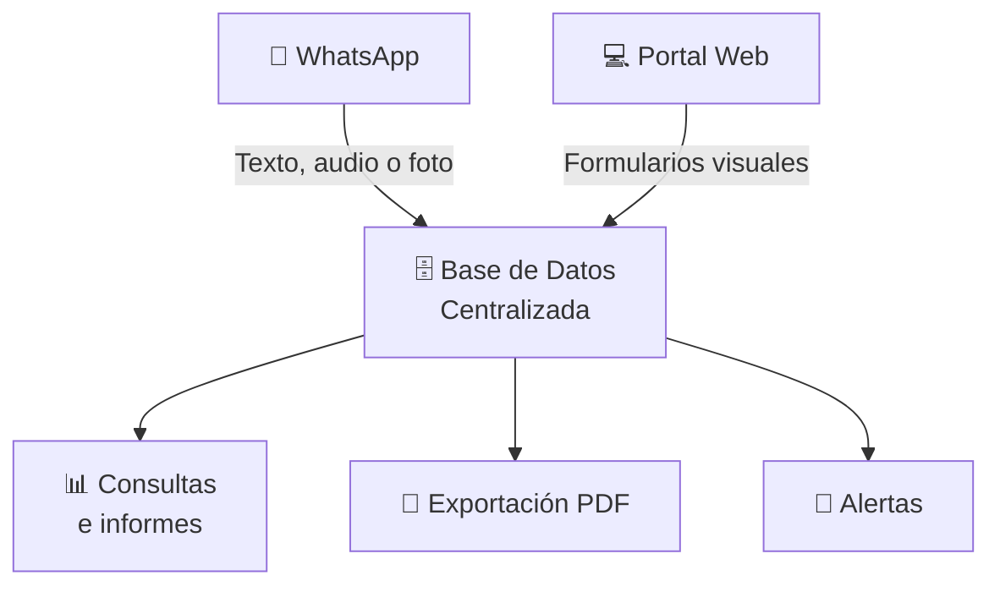

# 🌾 AGROHABILIS — Manual de Usuario Completo

> **Versión:** 2.4 · **Fecha:** Junio 2026
>
> Este manual cubre todas las funcionalidades de AgroHabilis, tanto por **WhatsApp** como por el **Portal Web**. Incluye ejemplos reales de uso, explicaciones de cada módulo, fórmulas de cálculo y resolución de problemas.

---

## 📑 Tabla de Contenidos

1. [Introducción a AgroHabilis](#cap-1--introducción-a-agrohabilis)
2. [Primeros Pasos: Registro y Onboarding](#cap-2--primeros-pasos-registro-y-onboarding)
3. [Planes y Suscripciones](#cap-3--planes-y-suscripciones)
4. [Precios y Mercados](#cap-4--precios-y-mercados)
5. [Tipo de Cambio (Dólar)](#cap-5--tipo-de-cambio-dólar)
6. [Clima y Precipitaciones](#cap-6--clima-y-precipitaciones)
7. [Inventario y Trazabilidad](#cap-7--inventario-y-trazabilidad)
8. [Sanidad y Carencia (SENASA)](#cap-8--sanidad-y-carencia-senasa)
9. [Finanzas Agrícolas](#cap-9--finanzas-agrícolas)
10. [Análisis de Conveniencia de Venta](#cap-10--análisis-de-conveniencia-de-venta)
11. [Fletes y Logística](#cap-11--fletes-y-logística)
12. [Formulación de Mixer y Raciones](#cap-12--formulación-de-mixer-y-raciones)
13. [Rotación de Pasturas (Semáforo)](#cap-13--rotación-de-pasturas-semáforo)
14. [Alertas Inteligentes de Precio](#cap-14--alertas-inteligentes-de-precio)
- [Apéndice A — Audio y Voz](#apéndice-a--audio-y-voz)
- [Apéndice B — Análisis de Fotos (Visión Artificial)](#apéndice-b--análisis-de-fotos-visión-artificial)
- [Apéndice C — Comandos Rápidos (Cheat Sheet)](#apéndice-c--comandos-rápidos-cheat-sheet)
- [Apéndice D — Portal Web y Registro de Datos](#apéndice-d--portal-web-y-registro-de-datos)
- [Apéndice E — Resolución de Problemas](#apéndice-e--resolución-de-problemas)

---

# Cap. 1 — Introducción a AgroHabilis

## ¿Qué es AgroHabilis?

**AgroHabilis** es tu asistente agropecuario inteligente que vive en tu WhatsApp. Pensado especialmente para **productores chicos y medianos de Argentina**, te permite gestionar tu establecimiento, consultar precios de mercado, registrar hacienda y cultivos, controlar finanzas y recibir alertas — todo desde un simple mensaje de texto, un audio o incluso una foto.

### El problema que resuelve

Hoy un productor tiene que consultar múltiples fuentes por separado:

- 📊 Precios de granos y hacienda en distintas bolsas y mercados
- 🌧️ Clima y alertas meteorológicas
- 💵 Dólar oficial, MEP y blue
- 📰 Noticias del sector agropecuario
- 📋 Registros de stock, gastos, ventas y sanidad

Esto consume tiempo y no ofrece una conclusión accionable para tu caso puntual.

### La solución

AgroHabilis **centraliza todo en un solo lugar** y te lo entrega filtrado por tu zona y tus cultivos. En cualquier momento del día podés consultarle lo que necesites en lenguaje natural, registrar datos de tu establecimiento por WhatsApp o desde el portal web.

## Filosofía de Diseño

### 🚜 La "Regla del Tractor"

El productor toma decisiones rápidas arriba del tractor, al lado de la tolva o metido en la manga con el ganado. No tiene tiempo para abrir una app pesada ni navegar menús complejos. AgroHabilis te resuelve en **2 segundos** con un mensaje de WhatsApp.

### ⚡ Tool-First (Herramientas primero)

Cuando mandás un mensaje, AgroHabilis no se pone a "pensar" de más. Primero ejecuta la acción concreta (buscar un precio, registrar un gasto, calcular una ración) y después humaniza la respuesta con un tono campero y cercano.

### 🤝 Calidez Campera

AgroHabilis no es un bot frío ni corporativo. Te saluda con cercanía, conoce tu provincia y localidad, comprende los modismos del campo argentino (*"lote"*, *"caravana"*, *"manga"*, *"rinde"*) y responde de forma clara y visual.

## Canales de Uso

| Canal | Descripción |
|-------|-------------|
| **WhatsApp** (principal) | Texto, audio y fotos. Funciona las 24 hs. |
| **Portal Web** | Dashboard visual en `agro.habilispro.com` para usuarios con plan pago. |

## Requisitos

- 📱 Celular con WhatsApp (cualquier sistema operativo)
- 🌐 Conexión a internet (funciona con datos móviles)
- No se necesita descargar ninguna app adicional

---

# Cap. 2 — Primeros Pasos: Registro y Onboarding

## ¿Cómo empezar?

Para comenzar a usar AgroHabilis, simplemente **mandá un mensaje al número de WhatsApp del servicio**. El bot te va a guiar paso a paso para registrarte.

## Flujo de Registro (3 pasos + ganadería opcional)

El onboarding es rápido y cálido. Solo necesitamos **3 datos básicos**:




### Paso 1 — Nombre y Apellido

> 🤖 **AgroHabilis:**
> Hola! Soy AgroHabilis 🌾, tu asistente agropecuario.
> Arrancás en Plan GRATIS y podés cambiarlo cuando quieras:
> - GRATIS: $0/mes
> - BASICO: $22.000/mes (QUIERO PLAN BASICO)
> - PRO: $29.000/mes (QUIERO PLAN PRO)
> - PRO MAX: $50.000/mes (QUIERO PLAN PRO MAX)
>
> Para empezar solo necesito tres datos rápidos.
> ¿Cuál es tu nombre y apellido?

> 🧑‍🌾 **Vos:** Juan Pérez

### Paso 2 — Provincia y Partido (Zona productiva)

> 🤖 **AgroHabilis:**
> ¿En qué provincia y partido trabajás?
> Separá zonas con guion (-).
> Formato: Provincia, Partido - Provincia, Partido
> Ej: Buenos Aires, Tandil - Córdoba, Río Cuarto

> 🧑‍🌾 **Vos:** Buenos Aires, Tandil - Buenos Aires, Azul

**Nota importante:** AgroHabilis geocodifica automáticamente cada zona usando coordenadas GPS para darte clima preciso de tu localidad. Si el nombre no se reconoce, te va a pedir que lo corrijas.

### Paso 3 — Cultivos / Actividad principal

> 🤖 **AgroHabilis:**
> ¿Qué trabajás principalmente?
> Podés elegir más de una opción: cultivos y/o ganadería.
> Ejemplos:
> - soja, maíz, trigo
> - ganadería
> - soja, maíz y ganadería

> 🧑‍🌾 **Vos:** soja, maíz y ganadería

### Paso 4 (solo si mencionaste ganadería) — Categorías de ganado

> 🤖 **AgroHabilis:**
> Perfecto. Para personalizar mejor ganadería, decime tipo/categorías de ganado separadas por coma.
> Ejemplos:
> - vacuno novillos, vacuno terneros
> - porcino madres, ovino ovejas

> 🧑‍🌾 **Vos:** vacuno novillos, vacuno terneros, vacuno vacas

### ✅ ¡Listo!

> 🤖 **AgroHabilis:**
> ¡Listo, Juan! Ya registré tus datos y configuré tu establecimiento. 🌾✨
>
> Ahora sí, ¿querés que te cuente lo que podés consultarme o hacer conmigo como tu asistente del campo?

## Completar Perfil (después del registro)

Después del registro inicial, podés completar tu perfil con más datos escribiendo **COMPLETAR PERFIL**:

| Opción | Qué agrega |
|--------|-----------|
| 1️⃣ Hectáreas y costos | Para análisis de margen y rentabilidad |
| 2️⃣ Lotes en distintas zonas | Múltiples establecimientos con geolocalización |
| 3️⃣ Datos de hacienda | Stock total y categorías |
| 4️⃣ Comercialización | Disponible o futuros |
| 5️⃣ Cultivos | Agregar o actualizar lista |

## Multi-zona

Podés registrar **múltiples zonas productivas** separándolas con guión:

```
Buenos Aires, Tandil - Córdoba, Río Cuarto - Santa Fe, Venado Tuerto
```

Cada zona se geocodifica automáticamente y AgroHabilis te da el pronóstico meteorológico específico de cada una.

---

# Cap. 3 — Planes y Suscripciones

## Filosofía: "Unbundled Features" (Funciones sin Barreras)

El **100% de las funciones avanzadas** están **desbloqueadas para todos los planes desde el primer día**. La única diferencia entre planes es el **cupo de interacciones semanales**.

Esto quiere decir que con el plan Gratis tenés acceso a alertas de precio, inventario, finanzas, visión artificial, raciones y todo lo demás — simplemente con un límite de uso semanal.

## Tabla Comparativa de Planes

| Característica | 🆓 GRATIS | 🟢 BÁSICO | 🟡 PRO | 🔥 PRO MAX |
|:---|:---:|:---:|:---:|:---:|
| **Precio Mensual** | **$0** | **$22.000** | **$29.000** | **$50.000** |
| **Consultas/semana** | 25 | 200 | 450 | **Ilimitado** |
| **Audios/semana** | 4 | 40 | 60 | **Ilimitado** |
| **Fotos/semana** | 2 | 15 | 22 | **Ilimitado** |
| **Zonas productivas** | Sin límite | Sin límite | Sin límite | Sin límite |
| **Todas las herramientas** | ✅ | ✅ | ✅ | ✅ |
| **Portal Web** | ❌ | ✅ | ✅ | ✅ |
| **Exportación PDF** | ❌ | ❌ | ✅ | ✅ |
| **Soporte** | Comunidad | Estándar | Estándar | **Prioritario 24/7** |

## ¿Cómo cambiar de plan?

Por WhatsApp, simplemente escribí:

- `QUIERO PLAN BASICO`
- `QUIERO PLAN PRO`
- `QUIERO PLAN PRO MAX`
- `QUIERO PLAN GRATIS` (para volver al gratuito)

Para ver tu plan actual: **`MI PLAN`**

## Consumo de Multimedia

Los **audios** (transcripción automática) y las **fotos** (procesadas por visión artificial) consumen cupo dentro de tus límites semanales. El sistema te avisa cuando estás cerca del límite y te sugiere upgradearte.

## Pago con Mercado Pago

Los pagos se procesan a través de **Mercado Pago**, de forma segura y automática. Al cambiar de plan, AgroHabilis te envía un link de pago personalizado.

---

# Cap. 4 — Precios y Mercados

## ¿Qué precios puedo consultar?

AgroHabilis recolecta precios de **más de 20 fuentes oficiales y de referencia** todos los días.

### Granos (Mercado Disponible)

| Cultivo | Fuentes principales |
|---------|-------------------|
| Soja | CAC-BCR (Pizarra Rosario), MAGyP FOB, AFA |
| Maíz | CAC-BCR, MAGyP FOB, AFA |
| Trigo | CAC-BCR, MAGyP FOB, AFA |
| Girasol | CAC-BCR, MAGyP FOB |
| Sorgo | CAC-BCR, MAGyP FOB |
| Cebada | CAC-BCR, MAGyP FOB |

### Granos (Futuros)

| Fuente | Posiciones |
|--------|-----------|
| MATba-Rofex | Soja, Maíz, Trigo (posiciones a futuro) |
| CBOT Chicago | Referencia internacional |

### Hacienda

| Categoría | Fuente |
|-----------|--------|
| Novillo, Vaca, Ternero, Vaquillona, Toro | Mercado Agroganadero (ex Liniers) |

### Otros

| Categoría | Fuente |
|-----------|--------|
| Papa | Argenpapa (Mercado Central BA) + MAGyP CSV |
| Insumos | Agrofy, Agroads (glifosato, urea, semillas, etc.) |
| Noticias Agro | InfoCampo, La Nación Campo, TodoAgro, Noticias de Campo |

## ¿Cómo consultar precios?

Simplemente preguntale en lenguaje natural:

> 🧑‍🌾 **Vos:** ¿Cuánto está la soja hoy?
>
> 🤖 **AgroHabilis:**
> 🌾 *SOJA — Precios del día*
> ━━━━━━━━━━━━━━━━━━━━
> • Pizarra Rosario (CAC): **$478.500 ARS/tn**
> • FOB MAGyP: **USD 388/tn**
> • Futuro Jul-26 (MATba): **USD 295/tn** (+0.3%)
> ━━━━━━━━━━━━━━━━━━━━
> 📅 Actualizado: 11/06/2026
> 📈 Tendencia 7 días: estable

Más ejemplos de consultas válidas:

- *"Precios de hoy"* → Muestra los granos principales
- *"¿Cuánto vale el maíz?"*
- *"Precio del novillo en Liniers"*
- *"¿Cómo está la hacienda?"*
- *"Precio de la urea"*
- *"¿Cuánto sale el glifosato?"*

## Validación Interna de Datos

AgroHabilis no publica cualquier dato que le llegue. Todos los precios pasan por un **validador interno** antes de llegar a tus consultas y resúmenes:

### ¿Cómo funciona la validación?



### Reglas de validación

1. **Estructural:** Campos requeridos: cultivo, mercado, fecha, precio
2. **Rango duro:** ARS 10.000 a 2.000.000 · USD 20 a 1.500
3. **Cruzada:** Compara contra el promedio interno de 7 días del mismo cultivo y moneda
4. **Umbral de desvío:**
   - Fuentes oficiales (MAGyP, CAC, MATba): rechazo si desvío > **60%**
   - Fuentes web (portales, noticias): rechazo si desvío > **35%**

### Score de Confianza

Cada precio recibe un puntaje de confianza basado en:

- **Origen del mercado:** MAGyP/CAC/MATba obtienen puntaje base más alto que fuentes web
- **Desvío:** Se penaliza proporcionalmente al desvío respecto de la referencia interna

Todo queda registrado en la tabla `validaciones_precios` para auditoría completa.

---

# Cap. 5 — Tipo de Cambio (Dólar)

## Cotizaciones disponibles

AgroHabilis te muestra tres cotizaciones del dólar:

| Tipo | Descripción |
|------|------------|
| **Oficial** (BNA) | Cotización del Banco Nación Argentina |
| **MEP** (Bolsa) | Dólar Mercado Electrónico de Pagos |
| **Blue** | Cotización paralela informal |

## Fuentes de datos

| Fuente primaria | Fallback |
|----------------|----------|
| DolarAPI (`dolarapi.com`) | Bluelytics (`api.bluelytics.com.ar`) |

El sistema consulta DolarAPI en tiempo real. Si la fuente principal falla, automáticamente usa Bluelytics como respaldo.

## ¿Cómo consultar el dólar?

> 🧑‍🌾 **Vos:** ¿Cómo está el dólar?
>
> 🤖 **AgroHabilis:**
> 💵 *Tipo de cambio — 11/06/2026*
> ━━━━━━━━━━━━━━━━━━━━
> • Oficial (BNA): $1.180 / $1.230
> • MEP: $1.295
> • Blue: $1.310
> ━━━━━━━━━━━━━━━━━━━━
> _Fuente: DolarAPI_

Otras formas de preguntar:
- *"¿Cuánto está el dólar blue?"*
- *"Dólar MEP hoy"*
- *"Cotización del oficial"*

## Actualización automática

El tipo de cambio se actualiza como parte del **recolector diario** (L-V 07:00 AR). Si la última fecha en la base es vieja, el sistema automáticamente trae datos frescos de DolarAPI y los persiste.

---

# Cap. 6 — Clima y Precipitaciones

## Pronóstico Georreferenciado

AgroHabilis usa las **coordenadas GPS** de tu zona productiva (registrada en el onboarding) para darte el pronóstico exacto de tu localidad usando **Open-Meteo** como fuente principal.

### Variables que incluye

- 🌡️ Temperatura (mínima, máxima, media)
- 💧 Precipitación esperada (mm)
- ❄️ Alertas de helada
- 💨 Viento (velocidad y dirección)
- 🌤️ Descripción general (soleado, nublado, tormenta)

## Cobertura Nacional

El sistema mantiene un catálogo de **22 localidades de referencia** distribuidas en todas las regiones agropecuarias:

| Región | Localidades incluidas |
|--------|----------------------|
| **NOA** | Salta, San Miguel de Tucumán, Santiago del Estero |
| **NEA** | Resistencia, Posadas, Corrientes |
| **Centro** | Santa Fe, Paraná, Córdoba, Rosario |
| **Pampeana** | Buenos Aires, La Plata, Mar del Plata, Santa Rosa |
| **Cuyo** | Mendoza, San Juan, San Luis |
| **Patagonia** | Neuquén, Viedma, Comodoro Rivadavia, Río Gallegos, Ushuaia |

### Geocoding dinámico

Si tu localidad no está en el catálogo, AgroHabilis usa **Nominatim** (OpenStreetMap) para resolver las coordenadas dinámicamente. El resultado se cachea por 24 horas para no repetir consultas.

## ¿Cómo consultar el clima?

> 🧑‍🌾 **Vos:** ¿Se puede fumigar mañana temprano?
>
> 🤖 **AgroHabilis:**
> 🌤️ **Condiciones de Aplicación Agrícola — Tu zona (Tandil, BA)**
> ━━━━━━━━━━━━━━━━━━━━
> 📅 *Mañana Temprano (07:00 a 10:00 AM):*
>
> • 🌡️ *Temperatura:* 9°C a 12°C (🟢 Excelente)
> • 💧 *Humedad Relativa:* 72% (🟢 Óptimo)
> • 💨 *Viento:* Sudoeste a 6 km/h (🟢 Bajo riesgo de deriva)
>
> 👉 *Veredicto:* **VENTANA DE APLICACIÓN ÓPTIMA.** Se sugiere concretar antes del mediodía.

Otras consultas válidas:
- *"¿Va a llover esta semana?"*
- *"Pronóstico para Tandil"*
- *"¿Hay riesgo de helada?"*
- *"Clima hoy"*

## Precipitaciones: ¿Cómo se calcula el acumulado?

**Fórmula del acumulado de 7 días:**

```
Precipitación_total_7d = Σ (precipitación_mm de cada día del pronóstico)
```

El sistema suma las precipitaciones esperadas de los próximos 7 días para darte una visión rápida de cuánta agua podés esperar en tu zona.

---

# Cap. 7 — Inventario y Trazabilidad

El módulo de inventario es uno de los más potentes de AgroHabilis. Te permite llevar el registro completo de tu establecimiento sin necesidad de planillas Excel.

## 7.1 — Cultivos y Lotes

### Registrar siembras

Podés registrar siembras simplemente escribiendo en lenguaje natural:

> 🧑‍🌾 **Vos:** Sembré 120 ha de maíz en el Lote Norte, variedad DK 72-10
>
> 🤖 **AgroHabilis:**
> ✅ *Siembra detectada:*
> ━━━━━━━━━━━━━━━━━━━━
> 📍 *Lote:* Lote Norte
> 🌾 *Cultivo:* Maíz
> ⚖️ *Hectáreas:* 120
> 🧬 *Variedad:* DK 72-10
>
> ¿Confirmás el registro?

### Datos que podés cargar por lote

| Dato | Ejemplo |
|------|---------|
| Cultivo | Soja, Maíz, Trigo, Girasol, Papa |
| Hectáreas | 120 ha |
| Variedad | DK 72-10, Nidera A 3009 |
| Fecha de siembra | 15/10/2026 |
| Densidad | 78.000 sem/ha |
| Rinde esperado | 90 qq/ha |
| Tipo de siembra | Directa, Convencional |
| Fertilizante | Urea, 120 kg/ha |
| Arrendado | Sí / No |

### Registrar aplicaciones e insumos

> 🧑‍🌾 **Vos:** Apliqué 120 kg/ha de urea en el Lote Norte para el trigo
>
> 🤖 **AgroHabilis:**
> ✅ *Aplicación de Fertilizante detectada:*
> 📍 *Lote:* Lote Norte · 🌱 *Labor:* Fertilización
> 🧪 *Insumo:* Urea · ⚖️ *Dosis:* 120 kg/ha
>
> ¿Confirmás el registro?

## 7.2 — Hacienda (Ganadería)

### Stock por categoría

Podés registrar tu rodeo indicando cantidad y categoría:

> 🧑‍🌾 **Vos:** Tengo 180 novillos y 45 terneros en el Lote Bajo Grande
>
> 🤖 **AgroHabilis:**
> ✅ *Movimiento de Ganado detectado:*
> 📍 *Lote:* Bajo Grande
> • 180 Novillos (vacuno)
> • 45 Terneros (vacuno)
>
> ¿Confirmás el registro?

### Especies reconocidas

| Especie | Categorías |
|---------|-----------|
| **Vacuno** | Novillos, Terneros, Vacas, Vaquillonas, Toros |
| **Porcino** | Cerdos, Lechones, Madres |
| **Ovino** | Ovejas, Corderos, Carneros |
| **Caprino** | Cabras, Chivos |
| **Camélido** | Llamas, Alpacas |
| **Equino** | Caballos, Yeguas |
| **Avícola** | Pollos, Gallinas, Ponedoras |

### Trazabilidad Individual (por caravana)

Podés registrar animales individualmente usando su número de caravana:

> 🧑‍🌾 **Vos:** Tengo 1 ternero caravana AR-105 de raza Aberdeen Angus de 280 kg en el Bajo Grande
>
> 🤖 **AgroHabilis:**
> ✅ *Animal individual registrado*
> • Caravana: **AR-105**
> • Categoría: Ternero
> • Raza: Aberdeen Angus
> • Peso: 280 kg
> • Lote: Bajo Grande

### Carga Multilote

Podés procesar múltiples ítems en un solo mensaje:

> 🧑‍🌾 **Vos:** Lote 1: 30 vacas; Lote 2: 45 novillos; Lote 3: 80 terneros

AgroHabilis parsea todo junto y te pide confirmar el lote completo de una vez.

## 7.3 — Insumos

Controlá tu stock de agroquímicos, fertilizantes y semillas:

> 🧑‍🌾 **Vos:** Tengo 50 bolsas de glifosato y 200 kg de urea en depósito

### Unidades reconocidas

| Unidad | Abreviaturas |
|--------|-------------|
| Kilogramos | kg, kilos |
| Litros | lt, litros |
| Bolsas | bolsas |
| Toneladas | tn, toneladas |
| Unidades | un, unidades |

## 7.4 — Grano Físico (en silo/acopio)

Registrá tus toneladas almacenadas:

> 🧑‍🌾 **Vos:** Tengo 350 toneladas de soja en el silo

## Flujo de Confirmación

Todos los registros de inventario pasan por un flujo de **confirmación**:



Cuando AgroHabilis detecta un registro de inventario:
1. Te muestra lo que interpretó y pregunta: *"¿Confirmás el registro?"*
2. Si respondés **"SI"** o **"Sí"**: confirma y actualiza tu saldo
3. Si respondés **"NO"**: rechaza y no modifica nada
4. Si mandás otro mensaje: el pendiente anterior expira automáticamente

---

# Cap. 8 — Sanidad y Carencia (SENASA)

## Trazabilidad Sanitaria Individual

AgroHabilis lleva un registro sanitario completo por cada animal identificado con caravana. Cada vez que registrás un tratamiento, el sistema:

1. **Guarda el evento sanitario** (tipo, fecha, detalle)
2. **Calcula automáticamente el período de carencia** según SENASA
3. **Te alerta** si el animal tiene retiro activo

## ¿Qué es el Período de Carencia?

Es el tiempo mínimo que debe transcurrir entre la aplicación de un fármaco y la faena o venta del animal, según normativa del **SENASA** (Servicio Nacional de Sanidad Animal). Garantiza que los residuos del medicamento ya no estén presentes en la carne.

## Fórmulas de Carencia

AgroHabilis calcula automáticamente la carencia según el tipo de tratamiento detectado en tus observaciones:

| Tratamiento | Días de carencia | Regla de detección |
|:---|:---:|:---|
| **Vacunas estándar** (aftosa, carbunclo, mancha, gangrena) | **0 días** | Palabras clave: aftosa, carbunclo, mancha, gangrena, vacun |
| **Ceftiofur, Hierro, Vitaminas** | **0 días** | Palabras clave: ceftiofur, hierro, vitamin |
| **Antiinflamatorios** (dexametasona, meloxicam, flunixin) | **7 días** | Palabras clave: dexametasona, meloxicam, flunixin, antiinflamatorio |
| **Antibióticos** (penicilina, oxitetraciclina, enrofloxacina, etc.) | **30 días** | Palabras clave: antibiotico, penicilina, oxitetraciclina, neumonia, infeccion |
| **Ivermectina / Desparasitarios** | **42 días** | Palabras clave: ivermectina, desparasitario, doramectina, abamectina |
| **Carencia explícita** | **N días** | Si escribís "carencia de N días" o "N días de retiro" |

### Fórmula de fecha de habilitación:

```
fecha_habilitación = fecha_tratamiento + días_carencia
```

### Ejemplo de interacción:

> 🧑‍🌾 **Vos:** Tengo 1 ternero caravana AR-105 tratado con antibiótico por neumonía en el lote Bajo Grande
>
> 🤖 **AgroHabilis:**
> ✅ *Observación registrada para la caravana **AR-105**:*
> > "Tratado con antibiótico por neumonía"
>
> 🛡️ **Período de Carencia (SENASA):**
> • **Caravana AR-105:** ⚠️ **Retiro/Carencia activo hasta 11/07/2026** (30 días de carencia obligatoria según SENASA para terapia antimicrobiana estándar).
> ❌ _Prohibida su venta a faena o salida de establecimiento hasta cumplir el plazo de seguridad._
>
> ¿Confirmás el guardado sanitario?

## Eventos que se registran

| Tipo de evento | Qué registra |
|:---|:---|
| **Pesaje** | Peso del animal en kg + fecha |
| **Sanidad** | Estado sanitario, observaciones clínicas |
| **Vacunación** | Tipo de vacuna aplicada |
| **Tratamiento** | Fármaco, dosis, motivo + carencia calculada |

---

# Cap. 9 — Finanzas Agrícolas

## 9.1 — Gastos

Registrá tus gastos en lenguaje natural. AgroHabilis los clasifica automáticamente por **categoría** y **perfil** (agricultura o ganadería):

> 🧑‍🌾 **Vos:** Gasté 2.500.000 en urea para el lote 5
>
> 🤖 **AgroHabilis:**
> ✅ Gasto registrado: fertilizante - $2.500.000 (agricultura).

### Categorías de gastos reconocidas

| Categoría | Ejemplos de texto |
|:---|:---|
| `semilla` | "semilla de maíz", "bolsas de semilla" |
| `fertilizante` | "urea", "fertilizante" |
| `agroquimico` | "glifosato", "agroquímico" |
| `arrendamiento` | "alquiler", "arrendamiento" |
| `flete` | "flete", "transporte" |
| `veterinario` | "veterinario", "consulta vet" |
| `sanidad` | "vacuna", "sanidad" |
| `alimentacion` | "alimento", "balanceado" |
| `labor` | "laboreo", "siembra" |
| `otro` | Todo lo que no encaje en las anteriores |

### Comandos de gastos

| Comando | Acción |
|---------|--------|
| `GASTÉ 250000 en semilla` | Registra un gasto |
| `COMPRÉ 10 bolsas de glifosato` | Registra un gasto (sinónimo) |
| `MIS GASTOS` | Muestra resumen de gastos del mes |

## 9.2 — Ventas

> 🧑‍🌾 **Vos:** Vendí 100 toneladas de soja a 430000
>
> 🤖 **AgroHabilis:**
> ✅ Venta registrada: soja - $43.000.000 (agricultura).

### Comandos de ventas

| Comando | Acción |
|---------|--------|
| `VENDÍ 100 toneladas de soja a 430000` | Registra una venta |
| `MIS VENTAS` | Muestra resumen de ventas del mes |

## 9.3 — Resumen Financiero (MI MARGEN)

Escribí **`MI MARGEN`** para obtener un resumen financiero mensual completo:


> 📊 *Resumen financiero mensual*
> - agricultura: gastos $4.500.000 | ventas $43.000.000 | margen $38.500.000
> - ganaderia: gastos $1.200.000 | ventas $8.000.000 | margen $6.800.000
>
> *Desglose gastos:*
> - fertilizante: $2.500.000
> - semilla: $1.200.000
> - agroquimico: $800.000

### ¿Cómo se calcula el margen?

```
Margen mensual = Σ Ventas del mes − Σ Gastos del mes
```

El cálculo se hace **por perfil** (agricultura vs ganadería) y se desglosa por categoría de gasto.

---

# Cap. 10 — Análisis de Conveniencia de Venta

Este es uno de los módulos más sofisticados de AgroHabilis. Combina datos de mercado, tu perfil productivo, costos, fletes y contexto macroeconómico para darte una **recomendación accionable** sobre si conviene vender hoy o esperar.

## ¿Cómo activarlo?

Escribí:

- `ANALIZAR SOJA`
- `ANALIZAR MAIZ`
- `ANALIZAR TRIGO`
- *"¿Me conviene vender soja hoy o esperar?"*

## ¿Qué datos cruza?



## Fórmulas detalladas

### Retenciones por cultivo

| Cultivo | Retención |
|:---|:---:|
| Soja | **33%** |
| Maíz | **12%** |
| Trigo | **12%** |
| Girasol | **7%** |
| Papa | **0%** |

### Precio Neto en Campo

```
Precio_neto = Precio_pizarra − Flete − (Precio × Retención) − (Precio × 2% gastos_comercialización)
```

**Ejemplo para soja a USD 388/tn, flete USD 12/tn:**

```
Precio_neto = 388 − 12 − (388 × 0.33) − (388 × 0.02)
            = 388 − 12 − 128.04 − 7.76
            = USD 240.20/tn
```

### Rendimiento

Si vos cargaste tu rendimiento esperado en el perfil, se usa ese dato. Si no, se usa el **promedio regional**:

| Cultivo | Rango regional (qq/ha) | Promedio usado |
|:---|:---:|:---:|
| Soja | 28 – 32 | **30** |
| Maíz | 75 – 90 | **82.5** |
| Trigo | 30 – 40 | **35** |
| Girasol | 18 – 24 | **21** |
| Papa | 300 – 450 | **375** |

### Ingreso por Hectárea

```
Ingreso/ha = Precio_neto × (Rendimiento_qq/ha ÷ 10)
```

**Ejemplo (soja, 30 qq/ha):**
```
Ingreso/ha = 240.20 × (30 ÷ 10) = 240.20 × 3.0 = USD 720.60/ha
```

### Costo por Hectárea

Si tenés tu costo cargado, se usa. Si no, se estima con **rangos regionales**:

| Cultivo | Campo propio (USD/ha) | Campo arrendado (USD/ha) |
|:---|:---:|:---:|
| Soja | 380 – 450 | 500 – 600 |
| Maíz | 480 – 560 | 620 – 720 |
| Trigo | 280 – 350 | 380 – 450 |

### Margen

```
Margen USD/ha = Ingreso/ha − Costo/ha
Margen %      = (Margen / Costo) × 100
```

**Ejemplo (soja, costo USD 415/ha):**
```
Margen USD/ha = 720.60 − 415 = USD 305.60/ha
Margen %      = (305.60 / 415) × 100 = 73.6%
```

### Diferencia con Futuros

```
Diferencia_futuro_% = ((Precio_futuro − Precio_disponible) / Precio_disponible) × 100
```

### Tendencia 30 días

```
Tendencia_30d_% = ((Precio_hoy − Precio_30d_atrás) / Precio_30d_atrás) × 100
```

## Ejemplo de respuesta completa

> 📊 *ANÁLISIS DE VENTA - SOJA*
> ━━━━━━━━━━━━━━━━━━━━━━━━
> 💰 *PRECIO ACTUAL*
> Disponible CAC: USD 388,00/tn
> FAS teórico: USD 375,00/tn
> Futuro Jul-26: USD 295,00/tn (-23,97%)
>
> 📈 *CONTEXTO DE MERCADO*
> Tendencia 30d: +2,35%
> Estacionalidad (junio): USD 380,00/tn
>
> 🌍 *FACTORES EXTERNOS*
> Dólar oficial: $1.230 | MEP: $1.295 | Blue: $1.310
> Retención estimada: 33%
> Chicago/CBOT ref: 1.080 cents/bu
> Clima zona: sin alertas fuertes
>
> 🚚 *FLETE Y PRECIO NETO EN CAMPO*
> Precio pizarra: USD 388,00/tn
> Flete Tandil a Puerto Rosario: - USD 12,50/tn
> Retención 33%: - USD 128,04/tn
> Gastos comerc. 2%: - USD 7,76/tn
> ━━━━━━━━━━━━━━━━━━━━━━━━
> Precio neto en campo: USD 239,70/tn
>
> 🧮 *TU SITUACIÓN*
> Costo por ha: USD 415,00 (estimado)
> Rendimiento: 30,0 qq/ha (estimado)
> Margen actual: USD 304,10/ha (73,3%) ✅
> Vendido: 0 tn | Remanente estimado: 360 tn
>
> ⚖️ *RECOMENDACIÓN*
> Con margen sólido y premio de futuro bajo, el riesgo de esperar es alto. Si necesitás caja, conviene vender hoy. Si podés esperar, fijá 50% y dejá 50% abierto.
>
> ⚠️ Recordá que esto es orientativo. Consultá con tu corredor antes de decidir.

---

# Cap. 11 — Fletes y Logística

## Calculadora de Fletes

AgroHabilis calcula el costo de flete entre tu zona y los destinos principales, ajustando por el **precio actual del gasoil**.

### ¿Cómo consultar?

> 🧑‍🌾 **Vos:** ¿Cuánto me cuesta el flete de soja a Rosario?

## Fórmulas de cálculo

### Factor de ajuste por gasoil

El costo del flete se ajusta según la variación del gasoil respecto de una tarifa base:

```
ΔGasoil = (gasoil_actual − gasoil_base) / gasoil_base

Factor_ajuste = 1 + (ΔGasoil × porcentaje_gasoil_en_costo / 100)
```

Donde:
- **gasoil_actual**: último precio del gasoil en la base de datos (de insumos o snapshot de mercado)
- **gasoil_base**: precio del gasoil usado como referencia en la tarifa original
- **porcentaje_gasoil_en_costo**: típicamente **35%** (el gasoil representa el 35% del costo total del flete)

### Tarifa ajustada

```
Tarifa_USD_km_tn_ajustada = Tarifa_USD_km_tn_base × Factor_ajuste
Tarifa_ARS_km_tn_ajustada = Tarifa_ARS_km_tn_base × Factor_ajuste
```

### Costo total del flete

```
Costo_USD_tn = Distancia_km × Tarifa_USD_km_tn_ajustada
Costo_total_ARS = (Costo_ARS_tn × Toneladas) + Peajes
```

### Ejemplo de cálculo

**Flete Tandil → Puerto Rosario (granos, 28 tn):**

| Variable | Valor |
|----------|-------|
| Distancia | 420 km |
| Tarifa base | USD 0.032/km/tn |
| Gasoil base | $980/lt |
| Gasoil actual | $1.120/lt |
| Porcentaje gasoil | 35% |
| Peajes | $15.000 |

```
ΔGasoil = (1120 − 980) / 980 = 0.1429

Factor = 1 + (0.1429 × 35 / 100) = 1 + 0.05 = 1.05

Tarifa ajustada = 0.032 × 1.05 = USD 0.0336/km/tn

Costo/tn = 420 × 0.0336 = USD 14.11/tn

Costo total = (14.11 × 28 tn) × TC + $15.000 peajes
```

### Rutas automáticas según perfil

AgroHabilis selecciona automáticamente las rutas relevantes según tu perfil:

| Perfil | Destinos consultados |
|--------|---------------------|
| Agricultor | Puerto Rosario, Puerto Bahía Blanca |
| Ganadero | Mercado Liniers |
| Fruticultor | Mercado Central BA |

---

# Cap. 12 — Formulación de Mixer y Raciones

## ¿Qué es el Formulador de Raciones?

Es una calculadora agronómica que computa la **ración diaria en Materia Seca (MS) y peso húmedo** para cargar en el mixer, basándose en estándares del **INTA**.

## Tipos de dieta disponibles

| Dieta | Composición |
|:---|:---|
| 🌾 **Suplementación** | 70% Silaje + 25% Maíz + 5% Concentrado |
| 🌽 **Feedlot** | 60% Maíz + 35% Silaje + 5% Núcleo |
| 🌿 **Pastura** | 100% Forraje Verde |

## Fórmulas base (estándares INTA)

### Paso 1: Consumo de Materia Seca

```
Consumo MS por cabeza = Peso_vivo × 2.8%
Consumo MS total      = MS_por_cabeza × Cantidad_cabezas
```

**Ejemplo: 150 novillos de 320 kg:**
```
MS/cabeza = 320 × 0.028 = 8.96 kg MS/día
MS total  = 8.96 × 150 = 1.344 kg MS/día
```

### Paso 2: Conversión a peso húmedo (por dieta)

Cada insumo tiene un porcentaje de Materia Seca diferente. Para obtener el **peso húmedo real** que se carga en el mixer, se divide la MS por el porcentaje de MS del insumo:

#### 🌾 Suplementación (70% Silaje, 25% Maíz, 5% Concentrado)

| Insumo | % de la dieta | % MS del insumo | Fórmula húmedo | Ejemplo (1.344 kg MS) |
|:---|:---:|:---:|:---|:---:|
| Silaje de maíz | 70% | 35% | `(MS_total × 0.70) ÷ 0.35` | **2.688 kg** |
| Maíz molido | 25% | 85% | `(MS_total × 0.25) ÷ 0.85` | **395 kg** |
| Concentrado proteico | 5% | 90% | `(MS_total × 0.05) ÷ 0.90` | **75 kg** |
| **TOTAL MIXER** | | | | **3.158 kg/día** |

#### 🌽 Feedlot (60% Maíz, 35% Silaje, 5% Núcleo)

| Insumo | % de la dieta | % MS del insumo | Fórmula húmedo | Ejemplo (1.344 kg MS) |
|:---|:---:|:---:|:---|:---:|
| Maíz molido | 60% | 85% | `(MS_total × 0.60) ÷ 0.85` | **949 kg** |
| Silaje de planta | 35% | 35% | `(MS_total × 0.35) ÷ 0.35` | **1.344 kg** |
| Núcleo invernada | 5% | 90% | `(MS_total × 0.05) ÷ 0.90` | **75 kg** |
| **TOTAL MIXER** | | | | **2.368 kg/día** |

#### 🌿 Pastura (100% Forraje Verde)

| Insumo | % de la dieta | % MS del insumo | Fórmula húmedo | Ejemplo (1.344 kg MS) |
|:---|:---:|:---:|:---|:---:|
| Forraje verde | 100% | 20% | `MS_total ÷ 0.20` | **6.720 kg/día** |

## Ejemplo de interacción completa

> 🧑‍🌾 **Vos:** Calculame la ración para 150 novillos en feedlot de 320 kg
>
> 🤖 **AgroHabilis:**
> 🧮 *AGROHABILIS - DIETA Y MIXER*
> ━━━━━━━━━━━━━━━━━━━━
> 👥 *Lote:* **150 animales** de **320 kg** promedio
> 📊 *Consumo Diario de Materia Seca (MS):*
> • Por cabeza: **8.96 kg MS/día**
> • Consumo total: **1.344 kg MS/día**
> ━━━━━━━━━━━━━━━━━━━━
> 🌽 *Feedlot / Engorde Intensivo* (60% Maíz, 35% Silaje, 5% Núcleo):
> • *Maíz Molido* (85% MS): **949 kg** (6.3 kg/cab)
> • *Silaje de Planta* (35% MS): **1.344 kg** (9.0 kg/cab)
> • *Núcleo Invernada* (90% MS): **75 kg** (0.5 kg/cab)
> ━━━━━━━━━━━━━━━━━━━━
> 👉 *PESO HÚMEDO TOTAL A CARGAR (MIXER):*
> 🚚 **2.368 kg/día**
>
> 💡 _Fórmula basada en estándares del INTA para recría e invernada._
> _Podés pedirme recalcular cambiando el tipo de dieta._

---

# Cap. 13 — Rotación de Pasturas (Semáforo)

## ¿Qué es el Semáforo de Pasturas?

Es un sistema visual que te muestra el estado de cada potrero/lote de tu establecimiento usando colores de semáforo:

| Semáforo | Estado | Significado |
|:---:|:---|:---|
| 🔴 | **Ocupado / Sobrepastoreo** | Animales adentro o descanso insuficiente (<20 días) |
| 🟡 | **Rebrote** | En descanso (20-35 días), no ingresar todavía |
| 🟢 | **Listo / Óptimo** | Descanso suficiente (>35 días), listo para pastoreo |
| ⚪ | **Sin datos** | No hay eventos registrados |

## Reglas del Semáforo

El semáforo se calcula automáticamente basado en el **último evento registrado** y los **días transcurridos**:



### Fórmula de días transcurridos

```
días_transcurridos = (fecha_actual − fecha_del_evento) / (1000 × 60 × 60 × 24)
```

## Tipos de eventos de pastura

| Tipo | Emoji | Cuándo usarlo |
|:---|:---:|:---|
| `rebrote` | 🌿 | El lote ya tiene pasto disponible para pastoreo |
| `ingreso_animales` | 🐄 | Entraron animales al lote |
| `retiro_animales` | 🔄 | Salieron animales del lote |
| `inicio_descanso` | 💤 | El lote empieza período de clausura/descanso |
| `pesaje_pasto` | ⚖️ | Se estimó disponibilidad de forraje (kg MS/ha) |
| `nota` | 📝 | Observación general |

## Ejemplo de interacción

> 🧑‍🌾 **Vos:** El potrero 4 ya tiene rebrote, 38 días de descanso
>
> 🤖 **AgroHabilis:**
> 🌿 *Evento de pastura registrado* — *Potrero 4* (11/06/2026)
> Tipo: Rebrote / Listo para pastoreo
> Días de descanso: 38

> 🧑‍🌾 **Vos:** ¿Cómo viene la rotación del Bajo Grande?
>
> 🤖 **AgroHabilis:**
> 🔄 **Monitoreo de Pasturas - Lote: Bajo Grande**
> ━━━━━━━━━━━━━━━━━━━━
> 📊 *Estado actual:* 🔴 **Ocupado** (9 días de ocupación)
> • *Carga animal:* 180 novillos
> • *Semáforo de lotes linderos:*
>    - **Potrero 4:** 🟢 **Listo** (38 días de descanso)
>    - **Corral 3:** 🟡 **Rebrote** (25 días de descanso)
>
> 👉 *Recomendación:* Rotar los animales del **Bajo Grande** al **Potrero 4** hoy mismo.

---

# Cap. 14 — Alertas Inteligentes de Precio

## ¿Qué son las alertas?

Son avisos automáticos que AgroHabilis te envía a tu WhatsApp cuando un precio alcanza el valor objetivo que vos definiste.

## Crear una alerta

Usá las palabras clave **ALERTA** o **AVISAME** seguidas del detalle:

| Ejemplo | Qué hace |
|:---|:---|
| `AVISAME cuando la soja supere 450000` | Alerta cuando soja ≥ $450.000 |
| `ALERTA si el maíz baja de 240000` | Alerta cuando maíz ≤ $240.000 |
| `AVISAME si el dólar blue sube de 1500` | Alerta cuando blue ≥ $1.500 |
| `ALERTA cuando el trigo llegue a 280000` | Alerta cuando trigo ≥ $280.000 |

### Cultivos y tipos reconocidos

| Para precios de granos | Para dólar |
|:---|:---|
| soja, maíz, trigo, girasol | dólar blue, dólar oficial |
| novillo, ternero, vaca, vaquillona | |

### Tipos de alerta

| Tipo | Se dispara cuando |
|:---|:---|
| `precio_sube` | Valor actual **≥** valor objetivo |
| `precio_baja` | Valor actual **≤** valor objetivo |
| `dolar_sube` | Valor del dólar **≥** valor objetivo |
| `dolar_baja` | Valor del dólar **≤** valor objetivo |

## Ver alertas activas

> 🧑‍🌾 **Vos:** MIS ALERTAS
>
> 🤖 **AgroHabilis:**
> 📌 *Tus alertas activas*
> #12 - precio_sube soja objetivo 450000
> #13 - dolar_sube blue objetivo 1500
> #14 - precio_baja maíz objetivo 240000

## Cancelar una alerta

> 🧑‍🌾 **Vos:** CANCELAR ALERTA 12
>
> 🤖 **AgroHabilis:**
> 🛑 Alerta #12 desactivada.

## ¿Cómo se disparan las alertas?

Las alertas se evalúan diariamente cuando se actualizan los precios en el sistema:



## Notificación de alerta disparada

Cuando una alerta se cumple, recibís un mensaje así:

> 🚨 *Alerta AgroHabilis*
> La soja llegó a $452.000
> Tu objetivo era $450.000
>
> 📊 *Contexto:*
> - Variación vs ayer: ▲ 1.2%
> - Tendencia últimos 7 días: sube
>
> 💡 *Momento de decisión:*
> Con la tendencia alcista y tu objetivo alcanzado, evaluá tomar cobertura parcial o fijar precio según tu flujo de caja.

---

# Apéndice A — Audio y Voz

## Notas de Audio Activas

Podés mandar un audio de voz mientras recorrés el lote o manejás el tractor. AgroHabilis lo transcribe automáticamente y procesa tu pedido.

### ¿Cómo funciona?



### Motor de transcripción

| Motor | Prioridad | Velocidad | Modelo |
|:---|:---:|:---:|:---|
| **Groq Whisper** | Primario | < 1 segundo | whisper-large-v3 |
| **Gemini 1.5 Flash** | Fallback | 2-3 segundos | gemini-1.5-flash-latest |

El audio se fuerza a idioma **español** para mayor precisión con terminología agropecuaria.

### Ejemplo

> 🧑‍🌾 **Vos (Audio 0:12):** *"Hola bot, anotame que empezamos a sembrar el lote 3 de trigo a 140 kilos por hectárea"*
>
> 🤖 **AgroHabilis:**
> 🎙️ *Audio procesado con éxito:*
> 📍 *Lote:* Lote 3
> 🌱 *Labor:* Siembra
> 🌾 *Cultivo:* Trigo
> ⚖️ *Densidad:* 140 kg/ha
>
> ¿Confirmás el registro?

### Consumo

Los audios consumen dentro de tu **cupo semanal de audios** según tu plan.

---

# Apéndice B — Análisis de Fotos (Visión Artificial)

## ¿Qué puede analizar AgroHabilis con una foto?

| Categoría | Qué detecta |
|:---|:---|
| **Ganadería** | Conteo de animales, categorías, condición corporal, razas |
| **Agricultura** | Estado fenológico, malezas, plagas, daños (granizo, helada) |
| **Maquinaria** | Identificación de equipos, estado de infraestructura |
| **Documentos (OCR)** | Remitos, tickets de balanza, análisis de suelo |
| **Planos y Mapas** | Planos catastrales (para alta automática de múltiples lotes/potreros) |
| **Monitores** | Lectura de pantallas de John Deere, Case IH, Trimble |
| **Remates** | Planillas de remate de hacienda, pizarras de consignatarias |

## Ejemplo de uso

> 🧑‍🌾 **Vos (Foto adjunta):** ¿Qué tiene este cultivo de trigo?
>
> 🤖 **AgroHabilis:**
> 👁️‍🗨️ *Análisis de Foto en Vivo:*
> Identifico con un **87% de probabilidad** síntomas de **Mancha Amarilla del Trigo (Drechslera tritici-repentis)** en el tercio medio foliar.
>
> ⚠️ *Recomendación:*
> 1. Monitorear: si supera 20-30% de hojas activas, evaluar aplicación.
> 2. Fungicidas recomendados: Mezclas de Estrobirulinas + Triazoles.

## Motor de visión

El análisis se realiza con **Gemini 1.5 Flash/Pro** (visión multimodal). El sistema tiene un prompt especializado para el agro argentino que cubre ganadería, agricultura, infraestructura y OCR.

### Lectura inteligente de monitores de maquinaria

Si mandás una foto de la pantalla del monitor de tu tractor/cosechadora, AgroHabilis extrae automáticamente:

- Tipo de labor (siembra, cosecha, pulverización)
- Nombre del lote
- Hectáreas trabajadas
- Dosis o rendimiento promedio
- Variedad/producto aplicado
- Humedad media
- Velocidad de trabajo

### Consumo

Las fotos consumen dentro de tu **cupo semanal de fotos** según tu plan.

---

# Apéndice C — Comandos Rápidos (Cheat Sheet)

## Tabla completa de comandos

### 🧑‍💼 Perfil y Onboarding

| Comando | Acción |
|:---|:---|
| `COMPLETAR PERFIL` | Abrir menú para agregar datos al perfil |
| `MI PLAN` | Ver tu plan actual |
| `QUIERO PLAN BASICO` | Cambiar a Plan Básico |
| `QUIERO PLAN PRO` | Cambiar a Plan Pro |
| `QUIERO PLAN PRO MAX` | Cambiar a Plan Pro Max |
| `QUIERO PLAN GRATIS` | Volver al Plan Gratis |
| `VER COMANDOS` | Lista de comandos disponibles |

### 📊 Precios y Mercado

| Comando / Pregunta | Acción |
|:---|:---|
| *"Precios de hoy"* | Precios principales |
| *"¿Cuánto está la soja?"* | Precio de un cultivo |
| *"¿Cómo está el dólar?"* | Tipo de cambio |
| `ANALIZAR SOJA` | Análisis de conveniencia de venta |
| `ANALIZAR MAIZ` | Análisis de conveniencia de venta |
| `ANALIZAR TRIGO` | Análisis de conveniencia de venta |

### 🔔 Alertas

| Comando | Acción |
|:---|:---|
| `AVISAME cuando la soja supere 450000` | Crear alerta de precio |
| `ALERTA si el maíz baja de 240000` | Crear alerta de precio |
| `MIS ALERTAS` | Ver alertas activas |
| `CANCELAR ALERTA 12` | Desactivar alerta #12 |

### 💰 Finanzas

| Comando | Acción |
|:---|:---|
| `GASTÉ 250000 en semilla` | Registrar gasto |
| `COMPRÉ 10 bolsas de glifosato` | Registrar gasto (sinónimo) |
| `VENDÍ 100 tn de soja a 430000` | Registrar venta |
| `MIS GASTOS` | Ver gastos del mes |
| `MIS VENTAS` | Ver ventas del mes |
| `MI MARGEN` | Resumen financiero mensual |


### 🤖 Control del Bot

| Comando | Acción |
|:---|:---|
| `PAUSAR BOT` | Pausar respuestas automáticas |
| `ACTIVAR BOT` | Reactivar respuestas |
| `ESTADO BOT` | Ver si el bot está activo/pausado |

### 🛡️ Administración (solo admins)

| Comando | Acción |
|:---|:---|
| `ESTADO` | Estado general del sistema |
| `ESTADO IA` | Proveedores de IA configurados |
| `ESTADO DB` | Estado de la base de datos |
| `USUARIOS` | Totales y últimos registros |

### 🌾 Consultas libres en lenguaje natural

| Ejemplo | Módulo que activa |
|:---|:---|
| *"¿Va a llover esta semana?"* | Clima |
| *"¿Me conviene vender o esperar?"* | Análisis de venta |
| *"Registrá 50 novillos en el Lote 2"* | Inventario |
| *"Calculame la ración para 120 novillos de 350 kg"* | Mixer/Raciones |
| *"¿Cómo viene la rotación del potrero 4?"* | Pasturas |
| *"¿Cuánto me cuesta el flete a Rosario?"* | Fletes |
| *"Llovió 35 mm ayer en Tandil"* | Registro climático |

---

# Apéndice D — Portal Web y Registro de Datos

Además de WhatsApp, AgroHabilis cuenta con un **Portal Web completo** donde podés **ver, registrar y gestionar** toda la información de tu establecimiento de forma visual.

## Dos caminos para registrar datos

AgroHabilis te ofrece **dos canales equivalentes** para cargar y consultar la información de tu campo:



| Canal | Ideal para... | Ventaja principal |
|:---|:---|:---|
| **WhatsApp** | Registrar datos en el campo, arriba del tractor o en la manga | Rapidez: un mensaje y listo |
| **Portal Web** | Revisar datos, cargar información masiva, exportar reportes | Visión completa en pantalla grande |

**Los datos son los mismos.** Lo que cargás por WhatsApp aparece en el portal, y lo que cargás en el portal lo podés consultar por WhatsApp.

## Registro de datos por WhatsApp

Desde WhatsApp podés registrar **cualquier dato** de tu establecimiento escribiendo en lenguaje natural:

| Tipo de dato | Ejemplo de mensaje |
|:---|:---|
| 🌾 Siembras | *"Sembré 120 ha de maíz en el Lote Norte"* |
| 🐄 Hacienda | *"Tengo 180 novillos en el Bajo Grande"* |
| 💊 Sanidad | *"Vacuné contra aftosa al lote de terneros"* |
| 💰 Gastos | *"Gasté 2.500.000 en urea"* |
| 💵 Ventas | *"Vendí 100 tn de soja a 430.000"* |
| 🌧️ Lluvias | *"Llovió 35 mm ayer"* |
| 🌿 Pasturas | *"Ingresaron 80 novillos al potrero 4"* |
| 🧪 Aplicaciones | *"Apliqué glifosato 3 lt/ha en el Lote 2"* |
| 📸 Fotos | Mandá una foto de un remito, ticket de balanza o monitor de maquinaria |
| 🎙️ Audios | Dictá el registro por nota de voz |

Todos los registros pasan por un **flujo de confirmación**: AgroHabilis te muestra lo que interpretó y te pide "¿Confirmás?". Solo se guarda cuando respondés **SI**.

## Acceso al Portal Web

El portal web está disponible en **`agro.habilispro.com`** para usuarios con plan **Básico, Pro o Pro Max**.


### Login

1. Ingresá a `agro.habilispro.com/cliente-login.html`
2. Iniciá sesión con tu número de WhatsApp y la clave proporcionada
3. Accedé a tu dashboard personalizado

## Registro de datos desde el Portal Web

El portal web te permite cargar y gestionar datos de forma **visual e intuitiva** usando formularios, tablas, filtros y mapas interactivos. A continuación se detallan los módulos principales de la plataforma web y cómo utilizarlos:

### 🔍 Filtros de Control Global
* **Qué muestra y qué hace:** Esta barra de control ubicada en la parte superior te permite segmentar la información de todo el portal web. Al seleccionar un filtro, todos los gráficos, reportes, mapas, tablas y balances de stock se recalculan en cascada para mostrar únicamente los datos correspondientes.
* **Cómo usarlo:**
  1. Hacé click en los selectores de **Firma** (razón social) o **Campo** (establecimiento) para elegir los que deseas visualizar.
  2. También podés segmentar por **Provincia** y **Localidad**.
  3. Presioná el botón **"Aplicar"** para actualizar la vista completa de AgroHabilis de manera instantánea.

### 🛰️ Catastro Satelital Interactivo
* **Qué muestra:** Un visor cartográfico interactivo que despliega los límites geográficos y polígonos de tus campos, lotes, corrales y feedlots. Además, dibuja marcadores con iconos dinámicos para identificar visualmente la hacienda (ganado) y la agricultura (siembras activas).
* **Cómo hacer para que aparezcan tus campos y lotes:**
  1. **Registrar coordenadas GPS:** Al crear o editar un Campo o Lote, ingresá su latitud y longitud correspondientes.
  2. **Elegir en el mapa:** Hacé click en el botón "Elegir en el mapa" en el formulario del elemento.
  3. **Dibujar polígono:** Utilizá las herramientas de dibujo (puntos, líneas y polígonos) para delimitar la superficie real en el mapa satelital. Al guardar, el lote aparecerá coloreado y geolocalizado en el mapa según el tipo de uso asignado.

### 📋 Listados y Controles de Gestión
* **Qué muestra:** Tablas administrativas editables organizadas en pestañas para controlar la estructura legal y física del campo (Firmas, Campos y Lotes/Corrales/Feedlots).
* **Cómo agregar y gestionar elementos:**
  * **Agregar Firmas:** Hacé click en **"+ Nueva Firma"** en la tabla de Firmas e ingresá el nombre o razón social. Podés editar o borrar registros desde las columnas de acción.
  * **Agregar Campos:** Hacé click en **"+ Nuevo Campo"**, asignale un nombre, vinculalo a una de tus Firmas creadas, definí la provincia/localidad e ingresá las coordenadas GPS del establecimiento.
  * **Agregar Lotes/Corrales/Feedlots:** Hacé click en **"+ Nuevo Lote"**, ingresá el nombre, hectáreas de superficie, vinculalo al Campo padre y definí su tipo de uso principal (Agrícola, Ganadero, Mixto).

### 📅 Gestión de Campañas
* **Qué es y qué muestra:** Una sección de control temporal para organizar tus ciclos productivos (ej: Campaña 2026). Muestra tarjetas expansibles con métricas en tiempo real de lotes cultivados, categorías de hacienda, insumos y cantidad de registros. Cada campaña cuenta con su propio *Cuaderno de Campo* integrado.
* **Cómo agregar y usar información:**
  1. Hacé click en **"+ Nueva Campaña"**, ingresá el nombre (ej: Campaña 25/26) y guardá.
  2. Al realizar registros de siembra, pasturas, márgenes o stock, seleccioná la campaña correspondiente en los formularios.
  3. Expandí la tarjeta de la campaña y escribí las observaciones climáticas, rendimientos obtenidos o notas de seguimiento en el editor del **Cuaderno de Campo**, presionando luego en **"Guardar Cambios"**.

### 🚜 Registrar Labor de Campo
* **Qué es y cómo usarlo:** Un bloque de carga rápida para registrar labores de campo directamente asociadas a tus parcelas.
* **Pasos para registrar:**
  1. Seleccioná el **Lote / Campo** correspondiente.
  2. Seleccioná el **Tipo de Labor** (Pulverización, Fertilización, Cosecha, Rolo, Siembra).
  3. Si la labor es una pulverización o fertilización, se desplegará el panel para ingresar los insumos/agroquímicos utilizados y la dosis.
  4. Agregá la fecha de ejecución, observaciones sobre plagas o rendimiento y hacé click en **"Guardar Labor"**.

### 🌾 Cultivos y Pasturas Activas
* **Qué muestra y cómo usarlo:** Una planilla consolidada que sirve de inventario de toda la superficie de tierra sembrada.
* **Cómo usarlo:** Permite visualizar de forma agrupada los lotes, cultivos, hectáreas, variedad de semilla, densidad y fecha de siembra. Se alimenta de forma automática de los registros del formulario de siembra o labores.

### 📅 Calendario Operativo Unificado
* **Qué es y qué muestra:** Un almanaque visual interactivo que centraliza todas las tareas programadas y actividades del establecimiento.
* **Cómo usarlo:**
  1. Para crear una actividad, hacé click en **"+ Planificar Tarea"**. Completá el título, descripción, seleccioná la categoría (Agricultura, Ganadería, Clima, etc.), definí las fechas de inicio/fin y asociala opcionalmente a un lote.
  2. Hacé click sobre cualquier evento del calendario para abrir la ficha de detalle de la actividad.
  3. Podés eliminar una actividad directamente desde su modal de detalle.

### 📝 Registro de Movimiento
* **Qué muestra y cómo usarlo:** Un bloque para ingresar registros o transacciones manuales que alteran las existencias físicas en el ledger.
* **Cómo usarlo:**
  1. Seleccioná el **Dominio** (Ganado, Cultivo, Granos en silos, o Insumo/Feed).
  2. Elegí el **Lote/Corral** y la **Campaña** de destino.
  3. Seleccioná el tipo de **Ajuste**: "Valor absoluto" (para fijar una cantidad fija de stock) o "Ajuste +/-" (para registrar entradas o salidas sumando/restando unidades al saldo actual).
  5. Cargá los detalles específicos del insumo o categoría de hacienda y presioná **"Guardar Registro"**.

### 📦 Balances de Stock Consolidados
* **Qué muestra y cómo usarlo:** Una tabla de saldos netos actuales que resume el inventario disponible en tiempo real.
* **Cómo usarlo:**
  1. Visualizá los saldos de granos en acopio, insumos en depósito y cabezas de hacienda por lote.
  2. Usá el selector **"Filtrar por Campaña"** para aislar el stock y existencias correspondientes a un ciclo de producción específico.
  3. Escribí en la barra de búsqueda para filtrar la tabla rápidamente por nombre de lote, cultivo o insumo.

## Secciones del Portal

### 🐄 Hacienda y Trazabilidad
- **Dashboard de stock** por categoría con semáforos de carencia SENASA.
- **Fichas individuales** por caravana con historial sanitario completo.
- **Tabla editable** para modificar datos de animales directamente.
- Exportación de planillas PDF oficiales para manga veterinaria.

### 🌾 Cultivos y Lotes
- **Mapa de lotes** con geolocalización.
- **Tabla de siembras** con variedad, densidad, rinde esperado.
- **Historial de labores** (fertilización, aplicaciones, cosecha).
- Edición directa de datos desde la tabla.

### 📅 Campañas Agrícolas y Ganaderas
- **Gestión centralizada** de campañas activas y cerradas.
- **Cuaderno de Campo integrado** para anotaciones sobre clima, labores, rendimiento, problemas y seguimientos.
- **Tarjetas resumen expansibles** por campaña.
- **Métricas visuales**: Resumen de Lotes Cultivados, Categorías de Hacienda, Insumos/Granos y Registros asociados a cada campaña.

### 💰 Finanzas
- **Gráficos de gastos y ventas** del mes.
- **Margen por perfil** (agricultura vs ganadería).
- **Desglose por categoría** de gasto con barras visuales.
- Referencias de precios de insumos vigentes.
- Tabla editable de movimientos financieros.

### 🔄 Rotación de Pasturas
- **Semáforo visual** de todos los lotes/potreros (🔴🟡🟢).
- Estado de ocupación y días de descanso en tiempo real.
- Historial completo de eventos de pastura.
- Registro directo de eventos desde la web.

### 🧮 Calculadora de Raciones
- Formulador de mixer interactivo.
- Selección visual de tipo de dieta (Suplementación, Feedlot, Pastura).
- Resultado con peso por insumo y totales para el mixer.

### 📊 Precios de Mercado
- Tabla con todos los precios del día (granos, hacienda, dólar).
- Histórico de precios por cultivo.
- Referencias cruzadas entre fuentes.

## Exportación PDF

Los usuarios **Pro y Pro Max** pueden exportar desde el portal:

- 📄 Planillas de trazabilidad de caravanas
- 📄 Historiales clínicos por animal
- 📄 Fichas de manga con formato oficial para firmas
- 📄 Reportes financieros mensuales
- 📄 Estado de rotación de pasturas

---

# Apéndice E — Resolución de Problemas

## "El bot no responde"

| Causa posible | Solución |
|:---|:---|
| Bot pausado | Escribí `ACTIVAR BOT` |
| Cupo semanal agotado | Upgrade de plan o esperar al lunes |
| Problema de conexión | Verificar tu internet y reintentar |
| Número no registrado | Mandá un "hola" para iniciar onboarding |

## "Se quedó en onboarding"

Si el bot se quedó esperando un dato del registro:

1. Respondé con el dato que te pidió (nombre, zona o cultivos)
2. Si no recordás en qué paso estabas, escribí tu **nombre y apellido** para reiniciar

## "Mis datos no son correctos"

Para actualizar tu perfil:

- Escribí `COMPLETAR PERFIL` y elegí la opción correspondiente
- Para agregar/cambiar cultivos: opción 5
- Para cambiar zona: opción 2

## "El precio parece incorrecto"

Los precios pasan por validación automática (ver [Cap. 4](#cap-4--precios-y-mercados)). Si un precio te parece raro:

1. Preguntá de nuevo especificando el cultivo: *"Precio soja CAC hoy"*
2. Si persiste, puede haber una demora en la fuente. Probá en un rato.

## Contacto de Soporte

- 📧 Email: soporte@agrohabilis.com
- 📱 WhatsApp: el mismo número del servicio, escribí "necesito ayuda"

---

> 🌾 **AgroHabilis** — El Cerebro del Lote
>
> _Toda la inteligencia agropecuaria que necesitás, en un solo mensaje._
>
> © 2026 AgroHabilis · Todos los derechos reservados.
